

  

<h1 align="center">Responsive Wannabe</h1>

Esercizio dedicato ad adattare un layout esistente a diverse risoluzioni
utilizzando le media queries CSS, senza modificare l’HTML e il CSS di partenza.

## Obiettivo

- Partire dal layout esistente del repo `html-responsive-wannabe`
- Rendere la pagina navigabile e leggibile alle seguenti larghezze:
  - **tablet**: fino a 768px
  - **mobile**: fino a 480px
- Non modificare l’HTML e il CSS già presenti, ma **aggiungere** solo nuove regole
  per gestire il comportamento responsive

## Media queries

- Aggiunta di media queries per:
  - adattare il layout alla visualizzazione **tablet** (≤ 768px)
  - adattare il layout alla visualizzazione **mobile** (≤ 480px)
  - migliorare il comportamento tra 768px e 1160px (bonus),
    evitando la comparsa della scrollbar orizzontale

## Anteprima

### Desktop
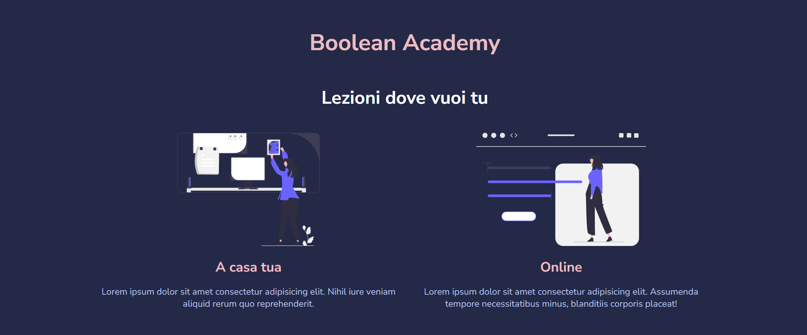  
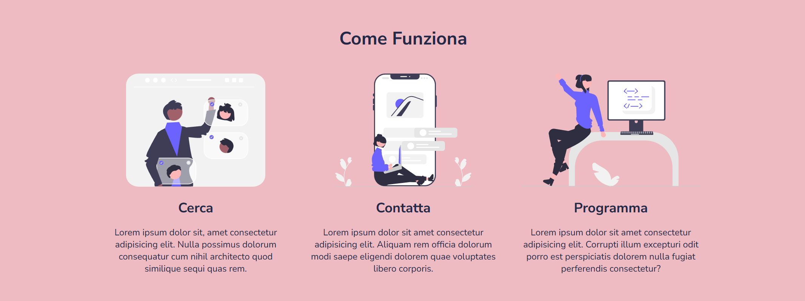  
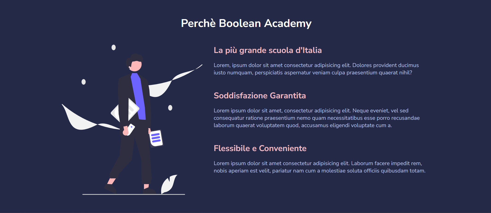

### Tablet
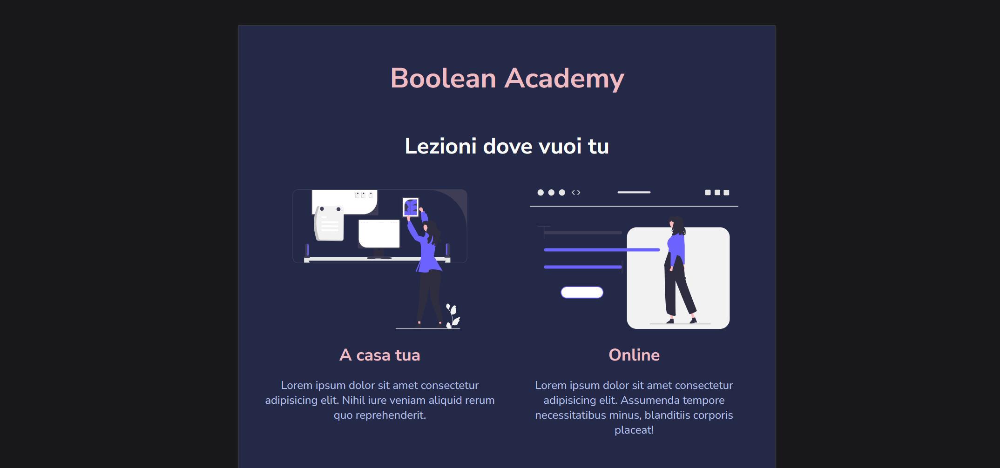  
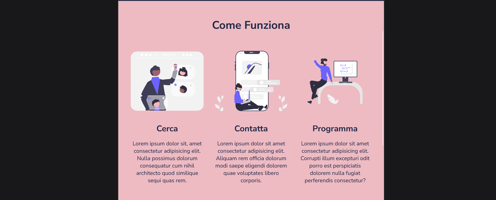  
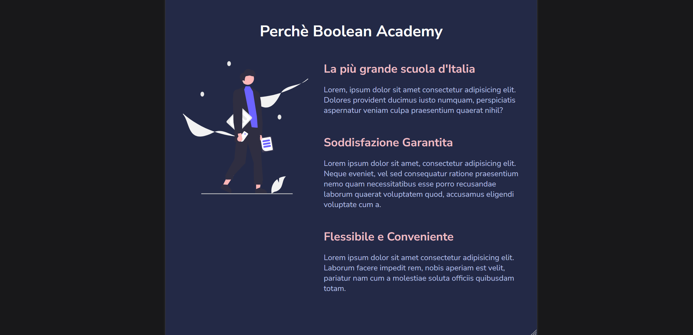

### Mobile
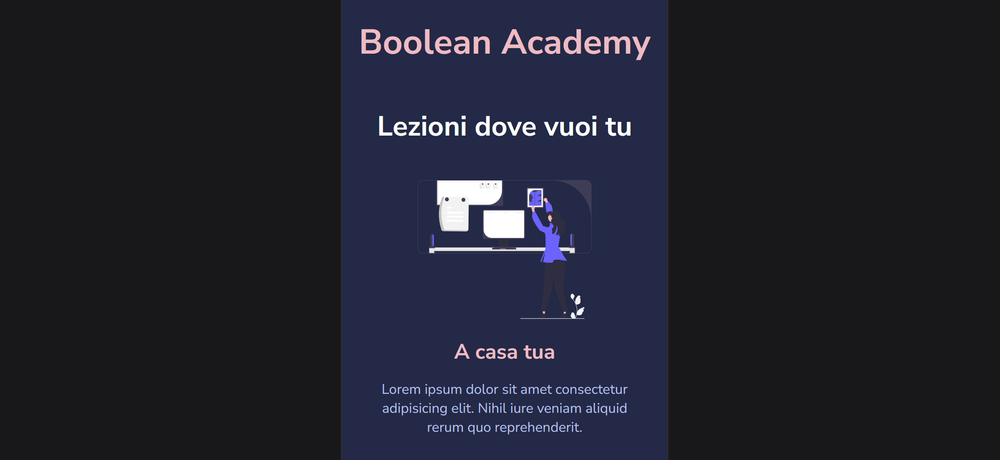  
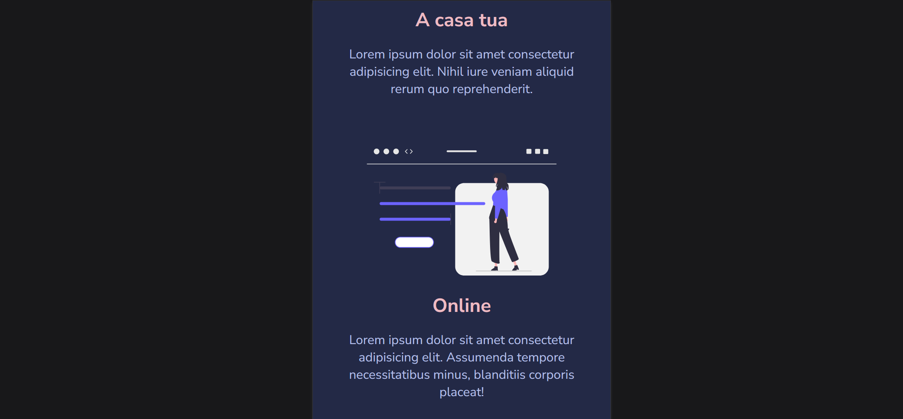  
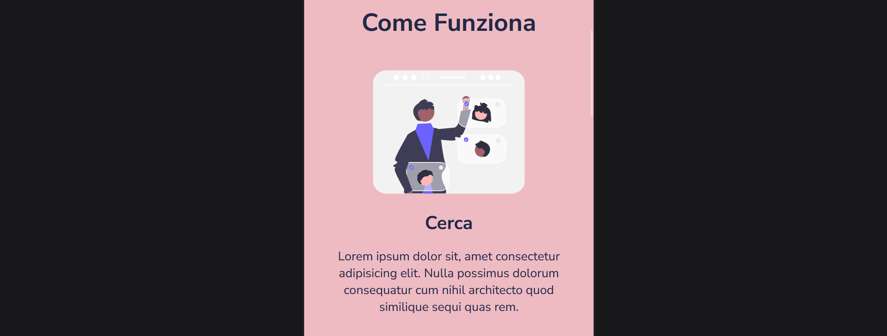  
  
  
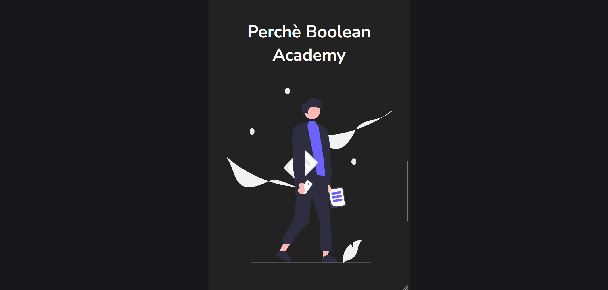  
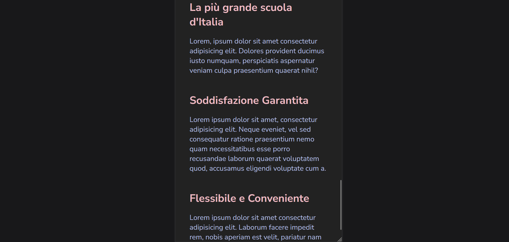

## Tecnologie utilizzate

- HTML5  
- CSS3 (media queries)
